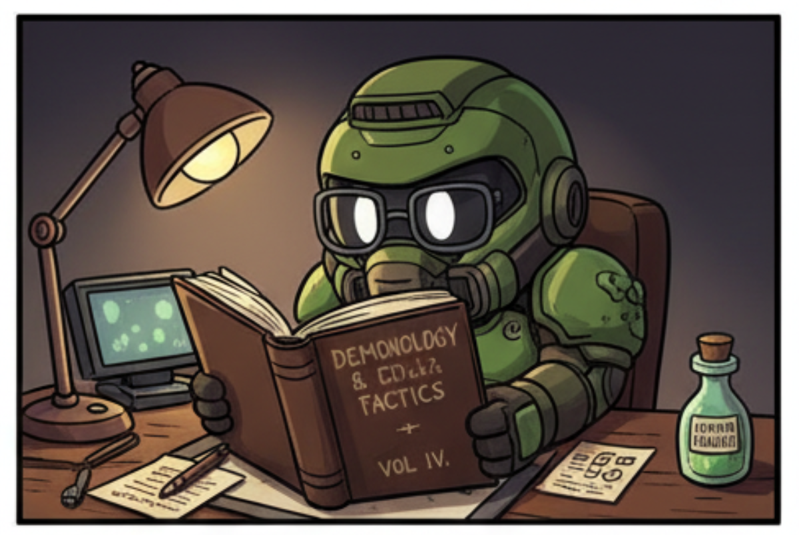

<p align="center" width="100%">
     
</p>

# Trajectory Doom

This is a fork of the Chocolate Doom source port, modified to track player location and other statistics for research purposes.

## Getting Started

These instructions will help you compile and run the project on a Debian-based Linux distribution (like Ubuntu).

### 1. Install Prerequisites

First, you need to install the necessary SDL libraries required to build the project. Open your terminal and run the following command:

```bash
sudo apt update
sudo apt install libsdl2-dev libsdl2-mixer-dev libsdl2-net-dev
````

### 2\. Build from Source

Next, navigate to the project's root directory and run the following commands to compile the source code:

```bash
./autogen.sh
make -j4
```

  * `autogen.sh` prepares the build environment.
  * `make -j4` compiles the project, using 4 CPU cores to speed up the process.

### 3\. Run the Game

To run the game, you need to provide a path to a Doom IWAD file (e.g., `DOOM.WAD`, `DOOM2.WAD`).

From the project's root directory, execute the following command, making sure to adjust the path to your WAD file:

```bash
src/chocolate-doom -iwad /path/to/your/DOOM.WAD
```

Enjoy the game\!
